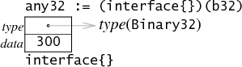

# Go Data Structures: Interfaces
Go语言中的interface—静态的，它会在编译阶段进行一些相关检测，但它又拥有一些动态的特性—从编程语言的设计角度来看，interface是最让我感到兴奋的，如果让我从go语言中选着一个特点加入到其他的语言当中，那一定是interface。

这篇文章阐述了在gc编译器中，interface变量的实现方式，之前Airs、Ian Lance Taylor已经写了两篇关于interface变量在gccgo编译器中的实现方式，这篇文章和他们非常的相似，最大的不同是这篇文章有图！

在了解interface的实现之前，我们先来看一下它的前置知识。

## 用法
go语言中的interface类型可以让你使用“鸭子类型”，它让你可以感受到像python一样纯粹的动态语言风格，但仍然会在编译的时候捕获到一些非常明显的错误，比如你传递的是int型，但程序期望的是一个拥有Read方法的对象；又或者你调用Read方法的时候传递了错误数量的参数。为了使用interface，第一件事情是定义interface类型（比如，ReadCloser）

    type ReadCloser interface {
        Read(p []byte) (n int, err os.Error)
        Close()
    }

然后你需要定义一个带有ReadClose类型参数的方法，例如下面的这个方法不断的调用Read去获取所有请求到的数据，然后调用Close：

    func ReadAndClose(r ReadCloser, buf []byte) (n int, err os.Error) {
        for len(buf) > 0 && err == nil {
            var nr int
            nr, err = r.Read(buf)
            n += nr
            buf = buf[nr:]
        }
        r.Close()
        return
    }

调用ReadAndClose的时候，你可以传递任何类型的参数，只要它拥有Read和Close两个方法，另外，不同于python语言，如果你传递了一个错误类型的参数，你会在编译阶段就会发现错误，而不是在运行时。

Interface类型并不只限于静态检测，你仍然可以在动态的时候判断一个interface变量是否有一些附加的方法，比如：

    type Stringer interface {
        String() string
    }

    func ToString(any interface{}) string {
        if v, ok := any.(String); ok {
            return v.String()
        }
        switch v := any.(type) {
        case int:
            return strconv.Itoa(v)
        case float:
            return strconv.Ftoa(v, 'g', -1)
        }
        return "???"
    }

参数any有一个静态的类型interface{}，不需要实现任何的方法，它可以包含任何的类型，在if语句中的“comma ok”赋值操作试图去判断将any转化为带有String方法的Stringer类型是否是可行的，如果可行，在if语句体中就会调用相应的String方法并返回结果，否则，在终止之前，通过switch类逐个尝试一些基本数据类型。这个是精简版的fmt包中的主要操作。（可以通过在switch顶部添加一个case Stringer来替换if语句，但是我在这里通过单独的语句去让关注点放在动态类型检测上）

这里有个简单的例子，我们来考虑一个64位的整数类型，它拥有一个可以打印出它的二进制值的String方法，和一个不太重要的Get方法：

    type Binary uint64

    func (i Binary) String() string {
        return strconv.Uitob64(i.Get(), 2)
    }

    func (i Binary) Get() uint64 {
        return uint64(i)
    }

Binary类型的变量在打印的时候，会自动调用String方法进行数据格式化，虽然代码中没有指明Binary实现了Stringer接口，但是在运行时还是会被判定实现了Stringer，因为它有一个String方法。

这个例子告诉我们，虽然所有的隐式类型转换在编译阶段已经被检测，在运行阶段还是需要通过必要的方法集查询来进行接口到接口类型的转化。“Effective Go” 这篇文章中有关于如何使用interface变量的更详细的说明。
## interface变量
目前的编程语言在处理方法调用的时候可以分为两个派别：静态语言（比如C++和Java等）在调用前会预先将方法存储在一张表中，动态语言（比如Javascript和Python等）则是在每次调用的时候在去查找对应的方法，然后通过缓存技术去优化查找效率。Go语言同时采用了这两种方式，它会预设一张方法表，但在运行的时候也会做一些查询工作。我不知道Go是不是第一个这么干的语言，但它肯定不是一个通用的方式。

先来个热身，假设一个Binary类型的变量是一个由两个32位字组成的64位的整数（参看上一篇文章，这里使用32位的机器）:

Interface变量用两个字来存储，提供两个指针，一个指向了存储在interface类型中的类型信息，另外一个指向关联数据。把b赋值给一个Stringer类型的interface变量，就会在内存中为其设置这两个指针的相应的值。

在interface变量中的指针箭头用灰色表示，用于说明他们是隐含的，没有直接暴露给go程序.

在interface变量中的第一个字指向的是一个interface表，或者叫itable，itable在头部存储了一些类型相关元数据，之后是一个函数指针的列表。注意itable不是和不动态类型对应的，而是和interface类型相对应。在我们的例子中，拥有Binary类型的Stringer变量的itable中，存放的仅仅是Stringer中的方法，Binary类型中的其他方法（比如Get）并不会放在itab里。

在interface变量中的第二个字指向了实际的数据，在这里数据指的是b的拷贝，之所以是拷贝而不是指针是因为它的赋值过程和var c uint64 = b一样，如果b发生了变化，s和c还是原来的值不会发生变化。存放在interface变量中的数据可以是任意大小的，但是只有一个字的空间被用于指向它，所以数据是在堆内存中进行分配，但是指针的值只是记录在一个字中（当数据只有一个字的时候这里有一个很明显的优化点，我们在下面再来分析）。

为了判定一个interface变量是否属于某种类型，就像在type switch这篇文章中说的，go的编译器会生成等价的C语言代码：s.tab->type，用于获取类型进行判断，如果类型匹配，就可以通过引用s.data拿到数据。

当你调用s.String()的时候，go的编译器会生成等价的C语言代码s.tab->fun[0](s.data)，你可以查看这些代码通过运行8g -S x.go（这篇文章的底部会有细节介绍），注意在itable中的函数接收的是interface变量的第二个字的指针，而不是具体的值，实际上，在itable中的函数指针所需要的就是32位的数据，因此这里的函数指针是(*Binary).String而不是Binary.String。
## 计算itable
现在我们知道itable长什么样子了，但是itable什么时候被生成出来的呢？go语言的动态类型转换机制意味着itable不是在编译或者链接阶段被预先生成的，因为有太多的接口类型和实体类型使我们实际不需要的，实际上，编译器会给每一个像Binary、int或func(map[int]string)的实体类型生成一个类型描述结构体，在一般的元数据中，类型描述结构体会包含一个被该类型实现了的方法列表，同样，go的编译器会为每一个像String一样的接口生成一个类型描述结构体，这个结构体中也包含接口的方法列表，itable会在运行时，通过在实体类型方法表中查找每一个接口类型中的方法来计算出来，而且在运行时会缓存生成出来的itable，所以这种对应关系只需要计算一次。

在这个简单的例子中，Stringer的方法表中只有一个方法，而Binary拥有两个方法，通常情况下，如果接口类型拥有ni个方法，而实体类型拥有nt个方法，那么构建接口类型和实体类型的映射关系需要花费的时间复杂度是：O(ni x nt)，但是我们可以做些优化，通过将两个方法表进行排序，然后同步的比对，我们能够将时间复杂度降低到：O(ni + nt)
## 内存优化
上面描述的优化空间，可以通过两个互补的方式实现。

首先，如果涉及到的接口类型是空的，也就是说没有接口类型的方法，那么itable除了提供原类型以外，没有其他作用，在这种情况下，itable可以被删除，然后指针直接指向原类型信息。

不管接口类型是否有方法，他都是一个静态的属性，要么代码中的类型被声明成interface{}，要么被声明成interface{ methods }，这样编译器就知道程序中应该如何进行处理。

另外，如果interface变量中的数据正好是一个机器字，那么久不需要在堆生进行分配，如果我们定义Binary32为Binary类型，但实现的时候是作为uint32，那么存放在interface变量的时候就可以放在第二个字中：

interface变量中的数据是使用指针还是内嵌的方式，由变量类型的大小决定。编译器会让类型方法表中的方法正确的使用传递给他的字，如果数据类型正好是一个字，那么久直接使用那个字，如果不是，就只是用字指向的数据，下图说明了这一点，在上面的Binary版本中的itable中的方法是(*Binary).String，但是在Binary32的例子中，itable中的方法是Binary32.String，而不是(*Binary32).String。

当然，只有一个字的数据的空的方法的interface变量，可以享受双重优化：

## 方法查找性能
Smalltalk等动态语言会在方法每次调用的时候进行方法查找，为了优化性能，会在每个调用位置使用一个简单的入口缓存，在一个多线程的程序中，这些缓存必须被妥善的管理，因为多个线程可能会同时使用，即使没有发生冲突，缓存依然是需要争夺的资源。

因为go有隐式的静态类型和动态方法查询，它能够将查找的执行从调用位置移到数据存放在interface变量的地方，例如，考虑下面的代码片段：

    var any interface{} // initialized elsewhere
    s := any.(Stringer) // dynamic conversion
    for i := 0; i < 100; i++ {
        fmt.Println(s.String())
    }

在go语言中，itable的计算或者查找是发生在第二行的赋值语句中，第四行的s.String()的调用在执行的时候只是进行内存数据抓取和间接指令调用。

我们来做个对比，在一些动态语言，比如Smalltalk或者javascript等，他们会在第四行做方法查询，这会因为循环导致做一些不必要的工作，上面提到的缓存会在这个地方做些优化，但是依然比执行一个间接指令要耗时。

当然，这只是一片博客，我不会花费太多的篇幅去论述这个问题，但是，很明显，在一个内存不足的高度并行的程序中，将方法查询的工作崇循环中移除是有优势的，当然，我这里指的是通用架构上，不是一些特定的实现，后面的那个方案中还有一些恒定的优化空间。

interface的运行时代码是在 $GOROOT/src/pkg/runtime/iface.c，这里面有关于interface以及类型描述更详细的信息，但这些内容需要等后面的文章介绍。

## 代码

    // x.go
    package main
    import (
        "fmt"
        "strconv"
    )

    type Stringer interface {
        String() string
    }

    type Binary uint64

    func (i Binary) String() string {
        return strconv.Uitob64(i.Get(), 2)
    }

    func (i BInary) Get() uint64 {
        return uint64(i)
    }

    func main() {
        b := Binary(200)
        s := Stringer(b)
        fmt.Println(s.String())
    }
